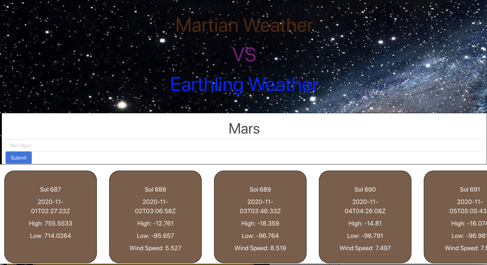

# Mars VS Earth

## Purpose
A website to look at what the weather on Mars compares to Earth so that one can get an idea of how it would be to live there (will add more later)

## Built With
* HTML
* CSS
* JavaScript
* Bulma
* Moment.js
* jQuery
* NASA - Mars Weather Forcast API
* NASA - Mars Rover Photos API
* Governemnt Weather Forecast API

## Website
https://mbogaert.github.io/mars-versus-earth-weather/

## Screenshot

## Contribution
Made with pride by Jonah Benson, Mathew Bogaert, Tylor Paggi, Chris Werkheiser

### ©️2020 Jonah Benson, Mathew Bogaert, Tylor Paggi, Chris Werkheiser