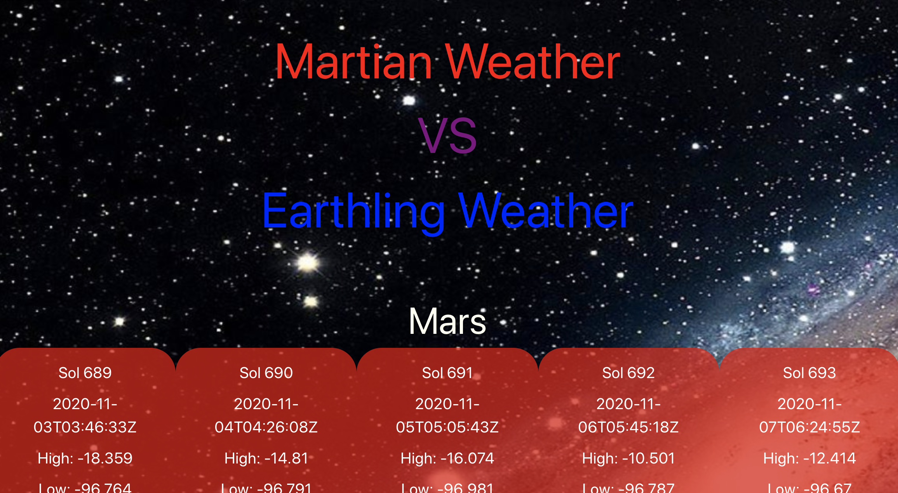

# Mars VS Earth

## Purpose
A website that allows the user to see the last five days of the weather on Mars so that the user can compare it to the weather on Earth. The site displays the last five days of weather on Mars, and when the user inputs a city on Earth the current and five-day weather forecast for Earth is displayed. This way the user can compare living on Mars to living on Earth. The site also displays ranomdly generated images from the Mars rovers each time there is a new search to give a visual as to what it would be like to live on Mars.

## Built With
* HTML
* CSS
* JavaScript
* Bulma
* Moment.js
* jQuery
* NASA - Mars Weather Forcast API
* NASA - Mars Rover Photos API
* Governemnt Weather Forecast API

## Website
https://mbogaert.github.io/mars-versus-earth-weather/

## Screenshot

## Contribution
Made with pride by Jonah Benson, Mathew Bogaert, Tylor Paggi, Chris Werkheiser

### ©️2020 Jonah Benson, Mathew Bogaert, Tylor Paggi, Chris Werkheiser